# 🎵 Music Recommender Simulation

## Project Summary

In this project, I designed a simple content-based music recommender system that simulates how real-world platforms like Spotify or TikTok suggest content. The system represents both songs and user preferences as structured data and uses a weighted scoring rule to measure how well each song matches a user's taste. Songs are then ranked by score and the top results are returned as recommendations. This project highlights how recommendation systems transform raw input features into predictions while also exposing real limitations — including bias, filter bubbles, and lack of diversity.

---

## How The System Works

Real-world recommenders like Spotify and YouTube learn user preferences from behavior (likes, skips, listening time) and combine multiple techniques such as collaborative filtering and content-based filtering. This simulation focuses entirely on the content-based approach, where recommendations are generated by directly comparing song features to a user's stated preferences.

Each `Song` is represented using structured attributes such as genre, mood, energy, valence, danceability, and acousticness. The `UserProfile` stores preferred values for these same features, forming a simplified representation of user taste.

### `Song` Features

Each `Song` object stores the following attributes drawn from `data/songs.csv`:

| Feature | Type | Description |
|---|---|---|
| `id` | integer | Unique identifier |
| `title` | string | Song name |
| `artist` | string | Performing artist |
| `genre` | categorical | Style category: pop, lofi, rock, ambient, jazz, synthwave, indie pop |
| `mood` | categorical | Emotional tone: happy, chill, intense, relaxed, focused, moody |
| `energy` | float 0–1 | Perceived intensity — 0.0 is calm, 1.0 is driving |
| `valence` | float 0–1 | Musical positivity — 0.0 is dark/melancholic, 1.0 is euphoric |
| `danceability` | float 0–1 | Rhythmic suitability for dancing |
| `acousticness` | float 0–1 | Acoustic vs. electronic character |
| `tempo_bpm` | integer | Beats per minute (60–152); normalized to 0–1 before scoring |

### `UserProfile` Fields

A `UserProfile` stores the user's preferred values for the same scoreable features:

| Field | Type | Description |
|---|---|---|
| `preferred_genre` | categorical | The genre the user most wants to hear |
| `preferred_mood` | categorical | The emotional tone the user is seeking |
| `preferred_energy` | float 0–1 | Target energy level |
| `preferred_valence` | float 0–1 | Target positivity level |
| `preferred_danceability` | float 0–1 | Target danceability |
| `preferred_acousticness` | float 0–1 | Target acousticness |
| `preferred_tempo_bpm` | integer | Target tempo in BPM |

### Scoring Rule

The scoring function awards additive points for each matching feature. Every component has a name and a maximum value, so any score can be fully explained in plain language.

**Step 1 — Genre match (categorical, binary)**

```
if song.genre == user.preferred_genre:
    score += 2.0
```

**Step 2 — Mood match (categorical, binary)**

```
if song.mood == user.preferred_mood:
    score += 1.5
```

**Step 3 — Energy similarity (continuous, proximity penalty)**

```
diff         = abs(song.energy - user.target_energy)
energy_score = max(0.0, 1.0 - 2 * diff)
score       += energy_score
```

The factor of `2` means a song must be within 0.5 energy units of the target to earn any points at all — intentionally steep, because a 0.5 gap almost always crosses an energy band (calm / mid / high-intensity).

**Maximum possible score: 4.5 pts**

| Component | Max pts | Share |
|---|---|---|
| Genre match | 2.0 | 44% |
| Mood match | 1.5 | 33% |
| Energy similarity | 1.0 | 22% |

Genre is the primary signal, mood adds emotional nuance, and energy acts as a proximity tie-breaker. No feature is hidden or implicit — every point in a song's final score maps to one of these three lines.

**Worked example** — user profile: `genre=lofi, mood=chill, target_energy=0.40`

| Song | Genre | Mood | Energy score | Total |
|---|---|---|---|---|
| Midnight Coding | lofi ✓ +2.0 | chill ✓ +1.5 | \|0.42−0.40\|=0.02 → 0.96 | **4.46** |
| Library Rain | lofi ✓ +2.0 | chill ✓ +1.5 | \|0.35−0.40\|=0.05 → 0.90 | **4.40** |
| Focus Flow | lofi ✓ +2.0 | focused ✗ +0 | \|0.40−0.40\|=0.00 → 1.00 | **3.00** |
| Spacewalk Thoughts | ambient ✗ +0 | chill ✓ +1.5 | \|0.28−0.40\|=0.12 → 0.76 | **2.26** |

### Ranking Rule

After every song is scored independently, the `Recommender` sorts the full catalog by score descending and returns the top-N results (default: 3). Sorting is separate from scoring — adding post-filters like "exclude already-heard songs" requires no changes to the scoring formula.

### Recommendation Pipeline

1. Load song catalog and user profile
2. For each song → apply scoring recipe → accumulate score
3. Sort all (song, score) pairs by score descending
4. Return top-N songs as recommendations

### Known Biases and Limitations

- **Genre dominance.** At 44% of the max score, a genre match is worth more than a perfect mood + energy combination (1.5 + 1.0 = 2.5 pts vs. genre alone at 2.0). A song that perfectly matches the user's mood and energy but sits in the wrong genre will almost always lose to a genre-match with a mediocre mood fit. If the user's real preference is vibe over genre label, this weighting will feel wrong.

- **Sparse catalog amplifies genre lock-in.** With only 20 songs and 15 distinct genres, most genres have just one representative. A user who prefers `metal` or `reggae` will only ever receive one genre-match candidate — the rest of their top-K will be decided entirely by mood and energy, making genre weight irrelevant for most of the list.

- **Mood is a single fixed label.** Each song carries one mood tag (e.g., `chill`, `intense`). Real songs can span multiple emotional states across their runtime. A song tagged `relaxed` may feel `chill` to one listener and `moody` to another, but the binary match treats any mismatch as zero points with no partial credit.

- **Energy is the only continuous signal.** The system ignores `tempo_bpm`, `valence`, `danceability`, and `acousticness` entirely. Two songs with the same genre, mood, and energy score identically even if one is acoustic folk and the other is electronic dance music.

- **No diversity or novelty mechanism.** The system always returns the closest matches. A user who enjoys lofi will receive only lofi recommendations with no exposure to adjacent genres (jazz, ambient), creating a filter bubble by design.

---


## Getting Started

### Setup

1. Create a virtual environment (optional but recommended):

   ```bash
   python -m venv .venv
   source .venv/bin/activate      # Mac or Linux
   .venv\Scripts\activate         # Windows

2. Install dependencies

```bash
pip install -r requirements.txt
```

3. Run the app:

```bash
python -m src.main
```

### Sample Output

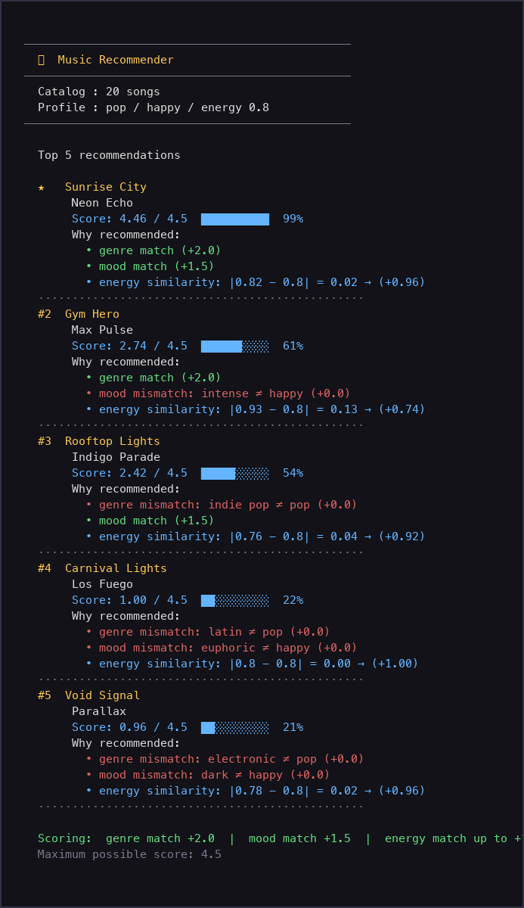

The sections below show the terminal output for each profile, rendered as images.
The first five are standard listener archetypes; the last six are adversarial profiles
designed to stress-test the scoring logic.

---

#### 1. High-Energy Pop

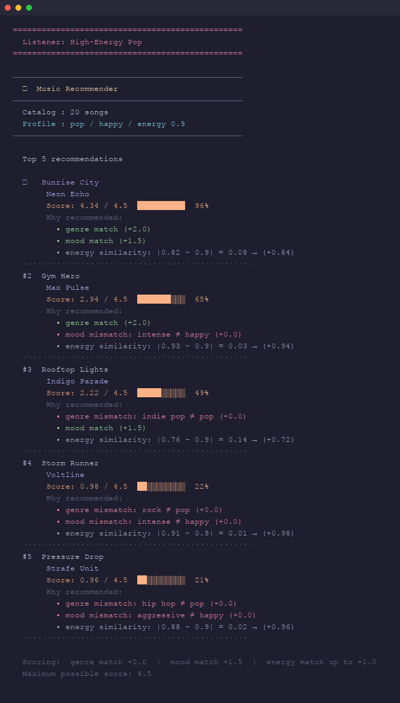

---

#### 2. Chill Lofi

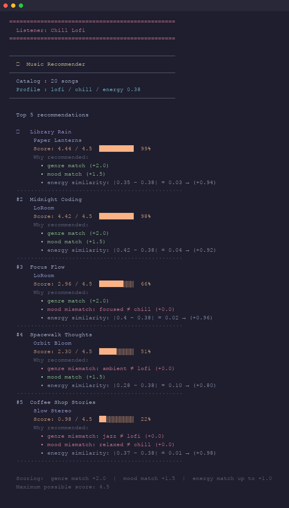

---

#### 3. Deep Intense Rock

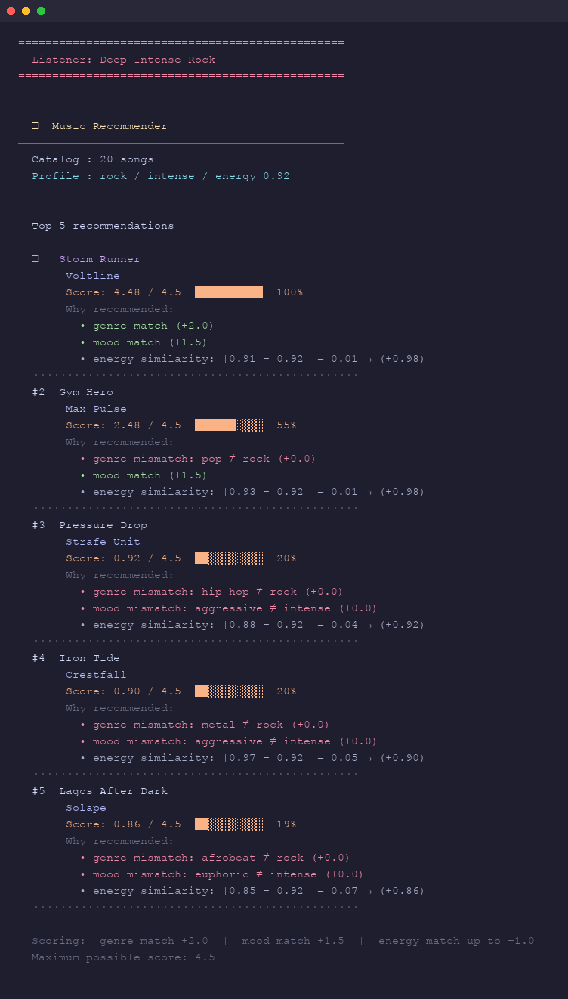

---

#### 4. Late-Night Synthwave

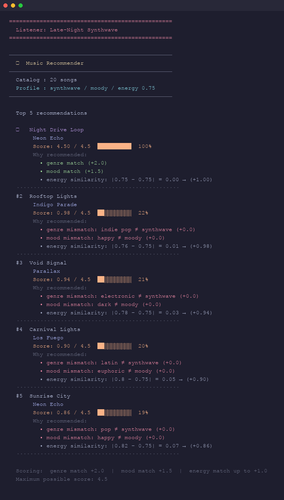

> **Note:** Night Drive Loop hits the perfect score of 4.50 — an exact match on all three axes.
> The #2 pick drops to 0.98 (only 22%), showing how dominant a single-song genre is when the catalog is sparse.

---

#### 5. Sunday Morning Jazz

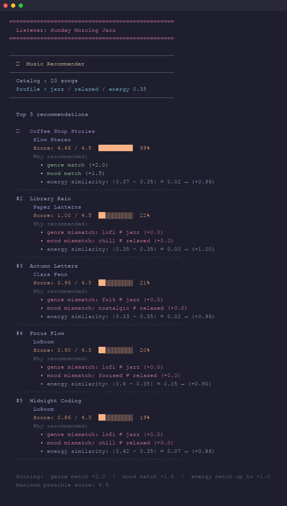

---

#### 6. Ghost Mood — adversarial: mood not in catalog

> **What this tests:** When `mood: "sad"` exists in no song, mood score is permanently 0.
> Genre alone separates the top results; energy breaks every tie within the genre group.

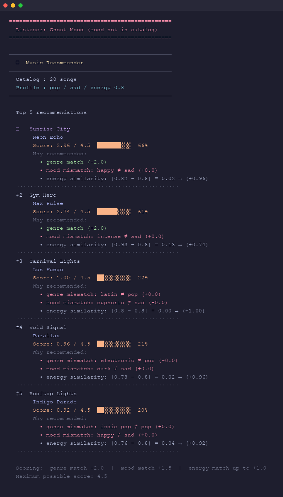

---

#### 7. Genre Vacuum — adversarial: genre not in catalog

> **What this tests:** `genre: "k-pop"` matches nothing, so the max reachable score drops to 2.5.
> The ranking shifts to mood-then-energy; the top songs look plausible but the explanations
> reveal every card is a genre mismatch.

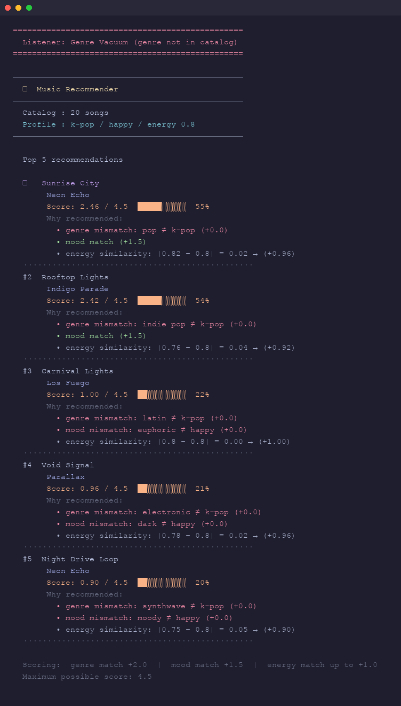

---

#### 8. Indie Substring Trap — adversarial: partial genre name

> **What this tests:** `genre: "indie"` feels like it should match `"indie pop"` but exact-string
> comparison fails silently. Rooftop Lights (the only indie-adjacent song) wins on mood+energy
> alone — its card shows `genre mismatch: indie pop ≠ indie (+0.0)`.

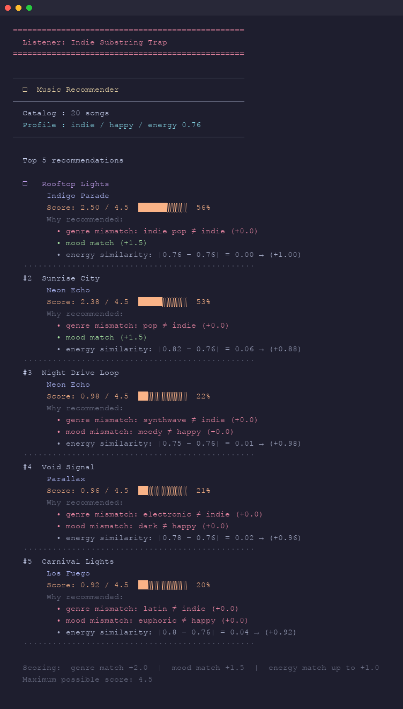

---

#### 9. Sad Headbanger — adversarial: conflicting mood + energy

> **What this tests:** `mood: "melancholic"` + `energy: 0.95` are contradictory.
> The only melancholic songs (Cathedral Light 0.22, Frozen Lake 0.19) have energy far from 0.95,
> so mood match awards +1.5 but energy contribution is +0.00 (diff > 0.5).
> Gym Hero and Iron Tide — neither classical nor melancholic — nearly outscore them on energy alone.

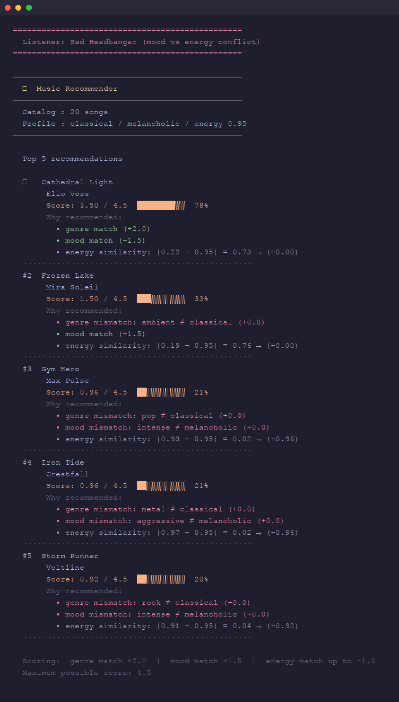

---

#### 10. Ultra Quiet — adversarial: energy floor (0.0)

> **What this tests:** `energy: 0.0` zeroes out every song whose energy ≥ 0.5 (13 of 20 songs).
> No catalog song actually reaches 0.0 so even the best energy match (Frozen Lake at 0.19)
> earns only +0.62. The ranking collapses to a two-feature system for most songs.

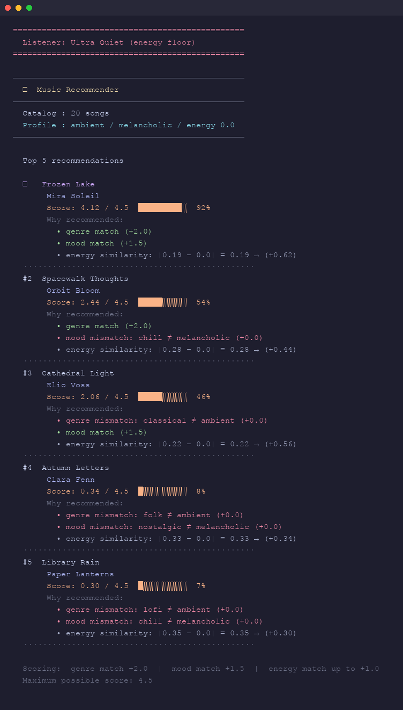

---

#### 11. Max Intensity — adversarial: energy ceiling (1.0)

> **What this tests:** Only Iron Tide (energy=0.97) sits within 0.5 of the ceiling and earns
> meaningful energy points. This tests whether one outlier song monopolizes the top slot.
> Iron Tide wins cleanly at 4.44 — a perfect triple match.

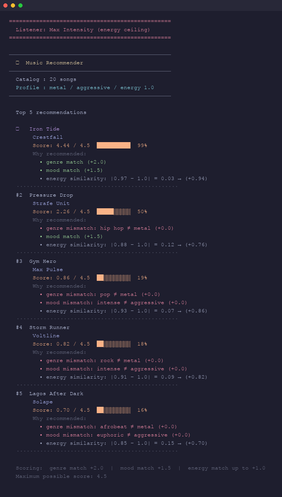

### Running Tests

Run the starter tests with:

```bash
pytest tests/
```

You can add more tests in `tests/test_recommender.py`.

---

## Experiments You Tried

Use this section to document the experiments you ran. For example:

- What happened when you changed the weight on genre from 2.0 to 0.5
- What happened when you added tempo or valence to the score
- How did your system behave for different types of users

---

## Limitations and Risks

Summarize some limitations of your recommender.

Examples:

- It only works on a tiny catalog
- It does not understand lyrics or language
- It might over favor one genre or mood

You will go deeper on this in your model card.

---

## Reflection

Read and complete `model_card.md`:

[**Model Card**](model_card.md)

Write 1 to 2 paragraphs here about what you learned:

- about how recommenders turn data into predictions
- about where bias or unfairness could show up in systems like this


---

## 7. `model_card_template.md`

Combines reflection and model card framing from the Module 3 guidance. :contentReference[oaicite:2]{index=2}  

```markdown
# 🎧 Model Card - Music Recommender Simulation

## 1. Model Name

Give your recommender a name, for example:

> VibeFinder 1.0

---

## 2. Intended Use

- What is this system trying to do
- Who is it for

Example:

> This model suggests 3 to 5 songs from a small catalog based on a user's preferred genre, mood, and energy level. It is for classroom exploration only, not for real users.

---

## 3. How It Works (Short Explanation)

Describe your scoring logic in plain language.

- What features of each song does it consider
- What information about the user does it use
- How does it turn those into a number

Try to avoid code in this section, treat it like an explanation to a non programmer.

---

## 4. Data

Describe your dataset.

- How many songs are in `data/songs.csv`
- Did you add or remove any songs
- What kinds of genres or moods are represented
- Whose taste does this data mostly reflect

---

## 5. Strengths

Where does your recommender work well

You can think about:
- Situations where the top results "felt right"
- Particular user profiles it served well
- Simplicity or transparency benefits

---

## 6. Limitations and Bias

Where does your recommender struggle

Some prompts:
- Does it ignore some genres or moods
- Does it treat all users as if they have the same taste shape
- Is it biased toward high energy or one genre by default
- How could this be unfair if used in a real product

---

## 7. Evaluation

How did you check your system

Examples:
- You tried multiple user profiles and wrote down whether the results matched your expectations
- You compared your simulation to what a real app like Spotify or YouTube tends to recommend
- You wrote tests for your scoring logic

You do not need a numeric metric, but if you used one, explain what it measures.

---

## 8. Future Work

If you had more time, how would you improve this recommender

Examples:

- Add support for multiple users and "group vibe" recommendations
- Balance diversity of songs instead of always picking the closest match
- Use more features, like tempo ranges or lyric themes

---

## 9. Personal Reflection

A few sentences about what you learned:

- What surprised you about how your system behaved
- How did building this change how you think about real music recommenders
- Where do you think human judgment still matters, even if the model seems "smart"

---

## 🧑‍🏫 Tech Fellow Notes

The core concept students needed to understand is that a recommender system does not "know" what sounds good, it only measures how closely a song's stored attributes match a user's stored preferences, and those measurements are only as meaningful as the features and weights chosen by the designer. Students most commonly struggled at the point where partial matches started competing: once the perfect song is found, the ranking felt obvious, but explaining *why* Gym Hero keeps appearing at #2 for a Happy Pop listener, despite feeling sonically wrong; required them to trace the exact math and confront the fact that two matched signals can outweigh one mismatched one regardless of which mismatch matters more. AI tools were genuinely helpful for explaining the energy formula, generating test profiles, and surfacing edge cases quickly, but they were misleading when students asked whether a weight change would "fix" the recommendations,  the AI would confirm a change made sense in theory without flagging that a 20-song catalog is too small for weight sensitivity to actually show up in the top result. To guide a student without giving the answer, ask them: "If you removed the genre score entirely and only used mood and energy, which songs would appear in the top five for the High-Energy Pop profile, and does that list feel more or less accurate than what you got before?"
